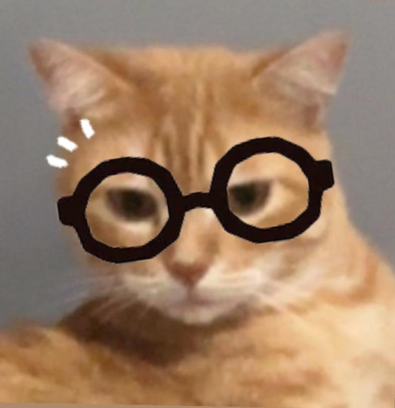
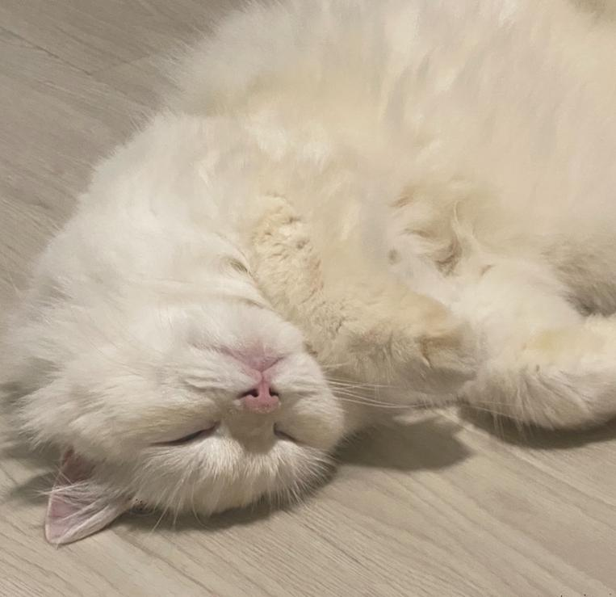

<!DOCTYPE html>
<html lang="en">
<head>
    <meta charset="UTF-8">
    <meta name="viewport" content="width=device-width, initial-scale=1.0">
    <title>🐱 Prof Eddie's Redox Lab 🐟</title>
    
</head>
<body>

    

        <h2>🔬 Redox Neko Lab 🐾</h2>
        
🐟 15 Lil' Fishes

    

    

        <h3>✨ Select Strategy Routine</h3>
        

            
⚡ Quick Start <small style="font-weight:normal;">Exactly 5 Tasks</small>

            
📚 Full Revision <small style="font-weight:normal;">Custom depth session</small>

        

        

            <label for="q-count"><b>Target Question Capacity:</b></label>
            <select id="q-count" style="padding: 5px; font-size: 1em;">
                <option value="10">10 Questions</option>
                <option value="15">15 Questions</option>
                <option value="20">20 Questions</option>
                <option value="25">25 Questions</option>
            </select>
        

        <h3>🧪 Core Chemistry Core Topic</h3>
        

            
🌀 General Half-Eqns & Transfers

            
⚔️ Metal Displacements

            
🧪 Acid-Base Oxidations

        

        <button class="action-btn" style="margin-top:20px;" onclick="startSession()">Enter the Lab 🐾</button>
    

    

        

            Topic
            Question 1/5
        

        

            

                
            

            

                
Prof Eddie

                
"Welcome! Let's parse electron densities. Remember, mass balance precedes balancing net systemic charge."

            

        

        
        

            

                
            

            

                
Xiaobai

                
"*Heavy breathing* Me saw shiny swimming fishies if you write correct numbers in boxes... please do it quickly!!"

            

        

        

            

        

            <label for="risk-wager"><b>Confidence Pool Wager:</b></label> 2 Fishes 
            <input type="range" id="risk-wager" min="1" max="10" value="2" style="width:70%; margin-top:8px;" oninput="document.getElementById('wager-val').innerText=this.value">
            
Lose your wager on incorrect submission; win back matching payout on success!

        

        <button class="action-btn" id="submit-btn" onclick="evaluateAnswer()">Verify Balanced Coefficients</button>
        <button class="action-btn" id="next-btn" style="display:none; background:#4a5568; box-shadow:0 4px 0 #2d3748;" onclick="advanceSession()">Next Chemical Challenge</button>
    

    

        <h3 style="text-align: center;">🏁 System Operations Complete!</h3>
        

        
        

        <h3>🏡 The Cat Tree Sanctuary</h3>
        
        

            <button class="tab-btn active" onclick="switchTab('box')">🎁 Blind Boxes</button>
            <button class="tab-btn" onclick="switchTab('furn')">🛋️ Decor & Space</button>
        

        

            

        

            <strong>🏯 Current Territory Portfolio:</strong> Cozy Cardboard Base
            

                

        

        <button class="action-btn" style="margin-top:20px; background:#4cbd93; box-shadow:0 4px 0 #276749;" onclick="returnToMenu()">Configure New Session</button>
    

    

        <h2 id="modal-title">🎁 Unboxing...</h2>
        
🎁

        

        <button class="modal-close-btn" onclick="closeModal()">Sweet! 🎉</button>
    

</body>
</html>
